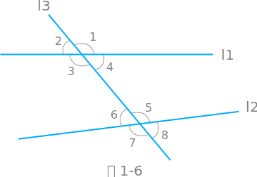

# 七年级下【浙教版数学】

> ## 第 1 章 平行线

### 1.1 平行线

-   在同一个平面内，不相交的两条直线叫做`平行线`【parallel lines】
-   直线 AB 和 CD 是平行线，记做 $AB // CD$ 或 $CD // AB$
-   **经过直线外一点，有且只有一条直线与这条直线平行**

### 1.2 同位角、内错角、同旁内角

-   如图 1-6，两条直线$l_1, l_2$，被第三条直接$l_3$所截，构成了 8 个角
-   $\angle1$ 与 $\angle5$，都在第三条直线$l_3$的`同旁`，并且在直线$l_1, l_2$的`同一侧`，这样的一对角叫做`同位角`【corresponding angles】
-   $\angle3$ 与 $\angle5$，都在第三条直线$l_3$的`异侧`，并且在直线$l_1$ 与 $l_2$ `之间`，这样的一对角叫做`内错角`【alternate interior angles】
-   $\angle3$ 与 $\angle6$，都在第三条直线$l_3$的`同旁`，并且在直线$l_1$ 与 $l_2$ `之间`，这样的一对角叫做`同旁内角`【same-side interior angles】

### 1.3 平行线的判定

-   两条直线被第三条直线所截，如果同位角相等，那么这两条直线平行`同位角相等，两直线平行`
-   在同一个平面内，`垂直于同一条直线的两条直线相互平行`
-   两条直线被第三条直线所截，如果内错角相等，那么这两条直线平行`内错角相等，两直线平行`
-   两条直线被第三条直线所截，如果同旁内角互补，那么这两条直线平行`同旁内角互补，两直线平行`

### 1.4 平行线的性质

-   两条平行线被第三条直线所截，同位角相等，`两直线平行，同位角相等`
-   两条平行线被第三条直线所截，内错角相等，`两直线平行，内错角相等`
-   两条平行线被第三条直线所截，同旁内角互补，`两直线平行，同旁内角互补`

### 1.5 图形的平移

-   平移不改变图形的形状和大小
-   一个图形和它经过平移所得的图形中，两组对应点的连线平行（或在同一条直线上）且相等。
-   要描述一个平移，必须指出平移的方向和移动的距离。

> ## 第 2 章 二元一次方程

### 2.1 二元一次方程

-   含有两个未知数，且含有未知数的项的次数都是一次的方程叫做`两元一次方程`【linear equation in two unknowns】
-   使二元一次方程两边的值相等的一对未知数的值，叫做`二元一次方程的一个解`

### 2.2 二元一次方程组

-   由两个一次方程组成，并且含有两个未知数的方程组，叫做`二元一次方程组`【linear system in two unknowns】
-   同时满足二元一次方程组中各个方程的解，叫做`二元一次方程组的解`

### 2.3 解二元一次方程组

-   **解方程组的基本思想是消元**，也就是把解二元一次方程组转化为解一元一次方程。
-   `代入消元法`简称`代入法`【substitution method】：用代入的方法消元。
-   `加减消元法`简称`加减法`【elimination method 】：对于二元一次方程组，当两个方程的同一个未知数的系数是互为相反数或相同时，可以通过把两个方程相加或相减来消元，转化为一元一次方程求解。
-   `代入消元法`与`加减消元法`都是解二元一次方程组常用的方法之一。

### 2.4 二元一次方程组的应用

> #### 例 2【答题规范】

一根金属棒在 0 °C 时的长度是 q(m)，温度升高 1 °C，它就伸长 p(m)。当温度为 t °C 时，金属棒的长度 l 可用公式 l = pt+q 计算。已测得当 t = 100 °C 时，l = 2.002m，当 t = 500 °C 时，l = 2.01m。

(1) 求 p，q 的值。 
(2) 若这根金属棒加热后长度伸长到 2.016m，问这时金属棒的温度是多少？

`解` (1) 根据题意，

$$
得 \left\{
\begin{array}{lr}
    100p+q=2.002　　& ①\\
    500p+q=2.01　　& ②
\end{array}
\right.
$$

$② - ①$，得 400p=0.008，解得 p=0.00002 
把 p=0.00002 代入 ① 得，0.002+q=2.002，解得 q=2

$$
即 \left\{
\begin{array}{lr}
    p=0.00002 \\
    q=2
\end{array}
\right.
$$

`答`: p=0.00002m，q=2m

(2) 由(1)，得 l=0.00002t+2 
金属棒加热后，长度伸长到 2.016m，即当 t=2.016 时，2.016=0.00002t+2 
解这个一元一次方程，得 t=800

`答`: 此金属棒的温度是 800 °C

### 2.5 三元一次方程组及其解法

-   含有三个未知数，且含有未知数的项的次数都是一次的方程叫做`三元一次方程`
-   由三个一次方程组成，并且含有三个未知数的方程叫做`三元一次方程组`
-   解三元一次方程组的消元方法也是`代入法`或`加减法`
-   通过消元将三元一次方程组转化为二元一次方程组，进而转化为解一元一次方程

> ## 第 3 章 整式的乘除

### 3.1 同底数幂的乘法

-   `同底数幂相乘`，底数不变，指数相加。
    $$a^m \cdot a^n=a^{m+n}　(m,n为正整数)$$
    $$a^m \cdot a^n = \underbrace{(a \cdot a \cdots a)}_\text{m个} \underbrace{(a \cdot a \cdots a)}_\text{n个} = \underbrace{(a \cdot a \cdots a)}_\text{m+n个} = a^{m+n}$$
-   `幂的乘方`，底数不变，指数相乘。
    $$(a^m)^n=a^{mn}　(m,n为正整数)$$
    $$(a^m)^n = \overbrace{(a^m \cdot a^m \cdots a^m)}^\text{n个} = a \overbrace{^{m+m+ \cdots + m}}^\text{n个} = a^{mn}$$
-   `积的乘方`，等于把积的没一个因式分别乘方，再把所得的幂相乘。
    $$(ab)^n=a^n b^n　(n为正整数)$$
    $$(ab)^n = \overbrace{(ab) \cdot (ab) \cdots (ab)}^{n个} = \overbrace{(a \cdot a \cdots a)}^{n个} \cdot \overbrace{(b \cdot b \cdots b)}^{n个} = a^n b^n$$

### 3.2 单项式的乘法

-   `单项式与单项式相乘`，把他们的系数、同底数幂分别相乘，其余字母连同它的指数不变，作为积的因式。
-   `单项式与多项式相乘`，就是单项式去乘多项式的每一项，再把所得的积相加。

### 3.3 多项式的乘法

-   `多项式与多项式相乘`，先用多项式的每一项乘另一个多项式的每一项，再把所得的积相加。
    $$(a+n)(b+m)=ab+am+nb+nm$$

### 3.4 乘法公式

-   `平方差公式`：两数和与这两数差的积等于这两数的平方差。
    $$(a+b)(a-b)=a^2-b^2$$
-   `两数和的完全平方公式`：两数和的平方等于这两数的平方和，加上这两数积的 2 倍。
    $$(a+b)^2=a^2+2ab+b^2$$
-   `两数差的完全平方公式`：两数差的平方等于这两数的平方和，减去这两数积的 2 倍。
    $$(a-b)^2=a^2-2ab+b^2$$

### 3.5 整式的化简

-   整式的化简因遵循先乘方、再乘除、最后算加减的顺序。
-   能运用乘法公式的则运用公式。

> 计算(1)【课外练习】

$$
\begin{array}{lr}
-2^9+2^{10} \\
= -2^9+2 \times 2^9& \\
= 2^9 \times (-1+2) \\
= 2^9
\end{array}
$$

> 计算(2)【课外练习】

$$
\begin{array}{lr}
2-2^2-2^3-2^4-2^5-2^6-2^7-2^8-2^9+2^{10} \\
= 2-2^2-2^3-2^4-2^5-2^6-2^7-2^8+(-2^9+2^{10}) \\
= 2-2^2-2^3-2^4-2^5-2^6-2^7-2^8+2^9 \\
= 2-2^2-2^3-2^4-2^5-2^6-2^7+(-2^8+2^9) \\
= 2-2^2-2^3-2^4-2^5-2^6-2^7+2^8 \\
\vdots \\
= 2+2^2 \\
=6
\end{array}
$$

### 3.6 同底数幂的除法

-   `同底数幂相除`，底数不变，指数相减。
    $$a^m \div a^n=a^{m-n} 　(m,n为正整数,且m>n)$$
-   任何不等于零的数的零次幂都等于 `1`。
    $$a^0=1 　(a \neq 0)$$
-   任何不等于零的数的 `-p` 次幂，等于这个数的 `p` 次幂的倒数。
    $$a^{-p}=\frac{1}{a^p} 　(a \neq 0,p为正整数)$$

### 3.7 整式的除法

-   `单项式除以单项式法则`：单项式相除，把系数、同底数幂分别相除，作为商的因式，对于只在被除式含有的字母，则连同它的指数作为商的一个因式。
-   `多项式除以单项式法则`：先把这个多项式的每一项除以这个单项式，再把所得的商相加。
    $$(a+b+c) \div m= a \div m + b \div m + c \div m 　(m \neq 0)$$

> ## 第 4 章 因式分解

### 4.1 因式分解

-   把一个多项式化成几个整式的积的形式，叫做`因式分解`【factorization】
    $$a^2+a=a(a+1)$$
    $$a^2-b^2=(a+b)(a-b)$$
    $$a^2 + 2ab +1=(a + 1)^2$$

### 4.2 提取公因式法

-   一个多项式中每一项都含有相同的因式，叫做这个多项式各项的`公因式`。
-   如果一个多项式的各项含有公因式，那么把该公因式提取出来进行因式分解，叫做`提取公因式法`。
-   `添括号法则`：括号前是 $+$ 号，括到括号里的各项都不变号；括号前是 $-$ 号，括到括号里的各项都变号。

### 4.3 用乘法公式分解因式

-   两个数的平方差，等于这两个数的和与这两个数的差的积。
    $$a^2-b^2=(a+b)(a-b)$$
-   两个数的平方和，加上（或者减去）这两个数的积的 $2$ 倍，等于这两个数和（或者差）的平方。  
     $$a^2 \pm 2ab +b^2=(a \pm b)^2$$
-   公式中 a，b 可以是数，也可以是整式。

> ## 第 5 章 分式

### 5.1 分式

-   $\frac{7}{p}, \frac{b}{a}, \frac{v-v_0}{t}, \frac{2x-3}{x+2}$ 这些代数式都表示两个整式相除，且除式中含有之母，这样的代数式叫做`分式`【algebraic fraction】
-   分式中之母的取值不能使分母为零；当分母为零时，分式就没有意义。

### 5.2 分式的基本性质

-   分式的分子与分母都乘（或除以）同一个不等于零的整式，分式的值不变。
    $$\frac{A}{B}=\frac{A \cdot M}{B \cdot M}　(M为不等于零的整式)$$
    $$\frac{A}{B}=\frac{A \div M}{B \div M}　(M为不等于零的整式)$$

### 5.3 分式的乘除

-   分式乘分式，用分子的积做分子，分母的积做分母。
    $$\frac{a}{b} \cdot \frac{c}{d} = \frac{ac}{bd}$$
-   分式除分式，把除式的分子、分母颠倒位置后，与被除式相乘。
    $$\frac{a}{b} \div \frac{c}{d} = \frac{a}{b} \cdot \frac{d}{c} = \frac{ad}{bc}$$

### 5.4 分式的加减

-   同分母的分式相加减，分式中的分母不变，把分子相加。
    $$\frac{a}{c} \pm \frac{b}{c} = \frac{a \pm b}{c}$$
-   把分母不同的几个分式化成分母相同的分式，叫做`通分`。
-   异分母分式加减转化为同分母分式加减。

### 5.5 分式方程

-   只含分式，或分式和整式，并且分母里含有未知数的方程叫做`分式方程`【equation with algebraic fraction】。
-   主要思想：通过去分母把分式方程化归为整式方程求解。
-   当分式方程含若干个分式时，通常可用各个分式的公分母同乘方程式的两边进行去分母。
-   必须注意： `解分式方程必须要验根`，即把求得得根代入`原方程`，或者代入原方程`两边所乘的公分母`，看分母的`值是否为零`。
-   使分母为零的根，叫做`增根`，增根使分式毫无意义，应该舍去。

> ## 第 6 章 数据与统计图表

### 6.1 数据的收集与整理

### 6.2 条形统计图和折线统计图

### 6.3 扇形统计图

### 6.4 频数与频率

### 6.5 频数直方图
